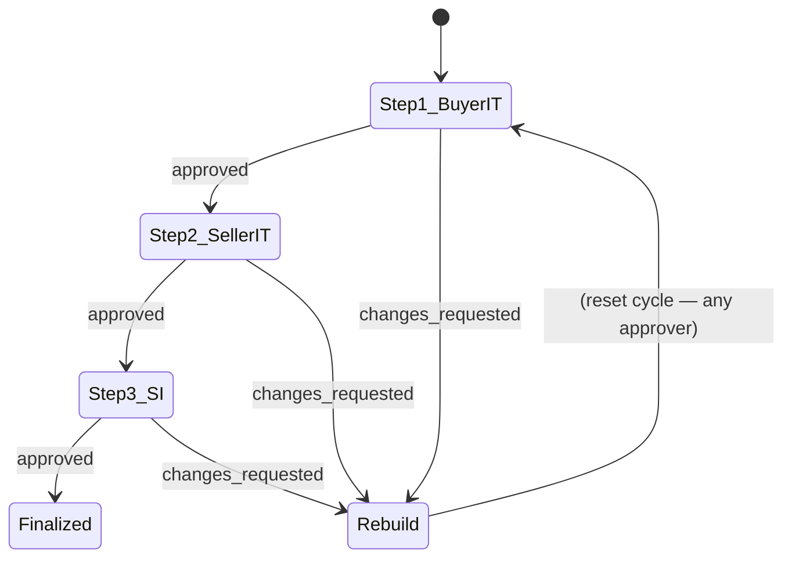
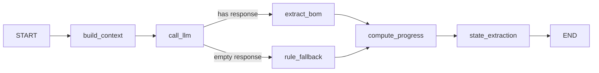
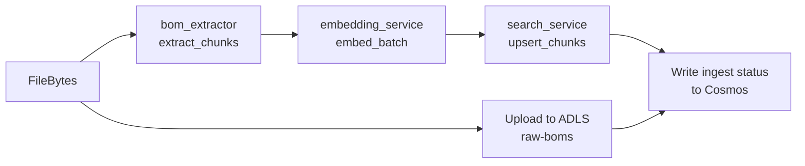
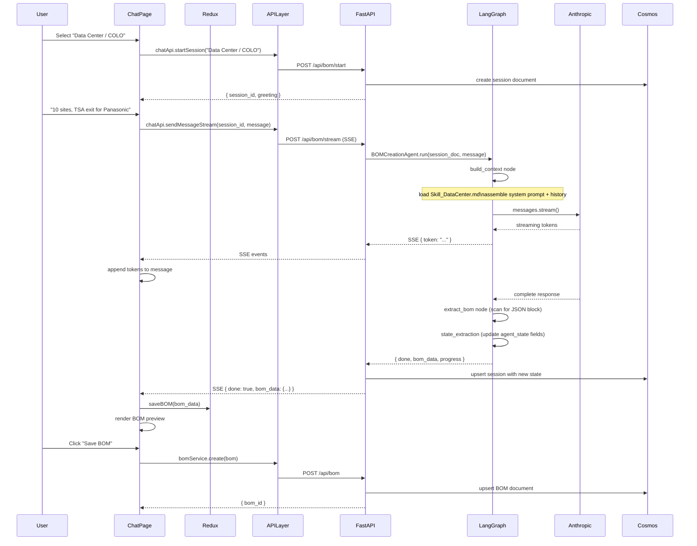
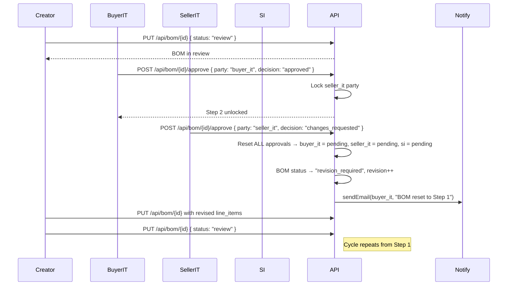

# Codebase Analysis — IT BOM Creation System

**Version:** 1.0  
**Date:** 2026-07-16  
**Audience:** Developers, architects, and maintainers with no prior knowledge of this codebase.

---

## Table of Contents

1. [Project Purpose](#1-project-purpose)  
2. [Technology Stack](#2-technology-stack)  
3. [Repository Layout & Responsibilities](#3-repository-layout--responsibilities)  
4. [Application Entry Points](#4-application-entry-points)  
5. [Architecture Overview](#5-architecture-overview)  
6. [Backend Deep-Dive](#6-backend-deep-dive)  
7. [Frontend Deep-Dive](#7-frontend-deep-dive)  
8. [Framework Layer](#8-framework-layer)  
9. [Extractor Module](#9-extractor-module)  
10. [AI / LLM Integration](#10-ai--llm-integration)  
11. [Data Models & Database](#11-data-models--database)  
12. [Service Layer](#12-service-layer)  
13. [Complete Feature Flows](#13-complete-feature-flows)  
14. [Frontend ↔ Backend Communication](#14-frontend--backend-communication)  
15. [Configuration & Environment Setup](#15-configuration--environment-setup)  
16. [Key Dependencies](#16-key-dependencies)  
17. [Potential Issues & Improvements](#17-potential-issues--improvements)

---

## 1. Project Purpose

This is an **AI-powered IT procurement tool** built for M&A (Mergers & Acquisitions) "Day 1" scenarios. It is branded as **PwC's M&A Contracting Tool** internally.

### Core Business Problem

When an acquisition closes, IT infrastructure must be operational on a hard **cutover date**. Building a Bill of Materials (BOM) manually takes 2–3 weeks due to:
- Manual spreadsheet creation
- 3-party sequential approval cycle (Buyer IT → Seller IT → SI/Systems Integrator)
- Any party requesting changes **resets the entire approval cycle back to Step 1**
- Multiple rebuild cycles are common (typically 3–5)

### What the System Does

| Capability | Impact |
|---|---|
| AI chat-based BOM creation | Reduces BOM creation from 2 hrs → 15 min |
| Vendor quote extraction | Automates ingestion of PDF/Excel quotes |
| BOM library with versioning | Reuse patterns across projects |
| 3-party approval workflow | Digital sequential approval with reset logic |
| Analytics dashboard | Spend patterns, vendor performance, cycle time KPIs |
| RFQ builder | Generates vendor-ready Request for Quote packages |
| EOL/EOS validation | Flags end-of-life SKUs before submission |
| SharePoint sync | Polls SharePoint for new BOMs, auto-ingests and embeds |

---

## 2. Technology Stack

### Backend

| Component | Technology |
|---|---|
| API Framework | Python FastAPI 0.109 + Uvicorn |
| AI Orchestration | LangGraph (state machine graph) + LangChain |
| LLM Providers | Anthropic Claude (primary), Azure OpenAI, Direct OpenAI |
| Database | Azure Cosmos DB (NoSQL) with in-memory mock for local dev |
| File Storage | Azure Data Lake Storage Gen2 (ADLS) with local filesystem mock |
| Search / RAG | Azure AI Search (vector embeddings) with in-memory mock |
| Embeddings | Azure OpenAI `text-embedding-3-large` (3072-dim) |
| SharePoint | Microsoft Graph API (`msgraph-core`) |
| Background Jobs | APScheduler (delta polling), Celery (declared, not wired) |
| Auth | Azure AD / MSAL (planned; currently no-op middleware) |
| Email | SMTP via `smtplib`; falls back to console logging |

### Frontend

| Component | Technology |
|---|---|
| Framework | React 18 + Vite 5 |
| State Management | Redux Toolkit (`@reduxjs/toolkit`) |
| UI Components | Material UI (MUI) v5 |
| HTTP Client | Axios + native `fetch` (for SSE streaming) |
| Charts | Chart.js 4 + `react-chartjs-2` |
| Routing | React Router DOM v6 |
| Auth Client | `@azure/msal-browser` (declared, not fully wired) |

### DevOps

| Component | Technology |
|---|---|
| Containerisation | Docker (multi-stage); separate Dockerfiles for frontend/backend |
| Local startup | `start-all.bat`, `start-backend.bat`, `start-frontend.bat` |
| Dev server proxy | Vite proxies `/api` and `/health` to `localhost:8001` |

---

## 3. Repository Layout & Responsibilities

```
vendor-contracting-dashboard/
├── backend/                  ← FastAPI app (primary server)
│   ├── main.py               ← FastAPI app factory + router registration
│   ├── config.py             ← Pydantic-settings; feature flags, all env vars
│   ├── healthcheck.py        ← Docker HEALTHCHECK helper script
│   ├── pipeline_test.py      ← Manual pipeline test runner
│   ├── ai/                   ← LLM client + agent implementations
│   │   ├── client.py         ← Multi-provider AI wrapper (Anthropic/OpenAI/Azure)
│   │   ├── agents/
│   │   │   ├── orchestrator.py     ← BOM state machine (phases + rule-based fallback)
│   │   │   └── analytics_agent.py  ← Natural-language spend analytics over BOM data
│   │   └── prompts/
│   │       └── system_base.py      ← Master system prompt for BOM specialist
│   ├── api/                  ← HTTP route handlers (FastAPI routers)
│   │   ├── chat.py           ← /api/bom/start, /chat, /stream, /history
│   │   ├── bom.py            ← /api/bom CRUD + Excel export + EOL validate
│   │   ├── analytics.py      ← /api/analytics/* KPI, spending, trends
│   │   ├── catalog.py        ← /api/catalog  product/service catalog
│   │   ├── templates.py      ← /api/templates  BOM templates CRUD
│   │   ├── sharepoint.py     ← /api/sharepoint/upload + files
│   │   ├── ingest.py         ← /api/ingest/*  BOM embedding pipeline trigger
│   │   ├── audit.py          ← /api/audit  in-memory audit log
│   │   └── notify.py         ← /api/notify/email  SMTP notifications
│   ├── db/                   ← Database layer
│   │   ├── schemas.py        ← Pydantic models: BOM, ChatSession, LineItem, etc.
│   │   ├── cosmos_client.py  ← Real Azure Cosmos DB wrapper
│   │   ├── mock_cosmos_client.py  ← In-memory + disk-persisted mock
│   │   ├── adls_client.py    ← Real Azure Data Lake Storage wrapper
│   │   ├── mock_adls_client.py    ← Local filesystem mock
│   │   └── sharepoint_client.py   ← Microsoft Graph SharePoint client
│   ├── services/             ← Business-logic services
│   │   ├── bom_delta_pipeline.py  ← APScheduler SharePoint polling + ingest trigger
│   │   ├── bom_extractor.py  ← Text chunking from uploaded files
│   │   ├── bom_ingest.py     ← Full pipeline: file → extract → embed → index
│   │   ├── embedding_service.py   ← Azure OpenAI embedding wrapper + mock
│   │   ├── eol_service.py    ← EOL/EOS SKU validation against JSON database
│   │   ├── search_service.py ← Azure AI Search wrapper + in-memory vector mock
│   │   └── sharepoint_delta.py    ← Graph API delta token management
│   └── data/
│       └── eol_skus.json     ← EOL reference database (SKU → dates, replacement)
│
├── frontend/                 ← React SPA
│   ├── vite.config.js        ← Vite config; proxies /api → localhost:8001
│   ├── src/
│   │   ├── main.jsx          ← React DOM render root
│   │   ├── App.jsx           ← React Router routes definition
│   │   ├── theme.js          ← MUI theme (PwC orange #D04A02 + dark grey)
│   │   ├── components/
│   │   │   └── Layout.jsx    ← App shell: sidebar nav, notifications panel
│   │   ├── pages/
│   │   │   ├── OverviewPage.jsx       ← Main dashboard: KPIs, charts, vendor heatmap
│   │   │   ├── ChatPage.jsx           ← AI chat BOM builder (main feature)
│   │   │   ├── BOMLibraryPage.jsx     ← BOM grid, category cards, upload
│   │   │   ├── BOMReviewPage.jsx      ← 3-party approval stepper workflow
│   │   │   ├── VendorPriceSelectorPage.jsx  ← Catalog multi-vendor price comparison
│   │   │   ├── RFQBuilderPage.jsx     ← RFQ assembly + vendor email dispatch
│   │   │   ├── QuoteExtractorPage.jsx ← Drag-drop CSV/JSON quote extraction
│   │   │   ├── AnalyticsPage.jsx      ← (legacy, redirected to Overview)
│   │   │   ├── DashboardPage.jsx      ← Unused alternative dashboard
│   │   │   └── EOLManagementPage.jsx  ← EOL SKU management (not routed)
│   │   ├── services/
│   │   │   ├── api.js        ← All API calls: chatApi, bomService, analyticsApi, etc.
│   │   │   └── bomApi.js     ← Alternative BOM-focused API service layer
│   │   └── store/
│   │       ├── index.js      ← Redux store configuration
│   │       └── slices/
│   │           ├── bomSlice.js          ← BOM list, currentBOM, activeBOMForRFQ
│   │           ├── chatSlice.js         ← Chat session, messages, streaming state
│   │           ├── authSlice.js         ← Auth state (stub)
│   │           ├── uiSlice.js           ← Sidebar open/close, theme
│   │           └── notificationsSlice.js ← Toast notifications queue
│
├── app/                      ← Domain-specific agent config (sits above framework)
│   ├── agents/
│   │   ├── bom_creation_agent.py    ← LangGraph BOM workflow (uses framework nodes)
│   │   ├── bom_prompt_config.py     ← Assembles PromptConfig from session state
│   │   └── bom_extraction_config.py ← Field extraction decision keys
│   ├── instructions/
│   │   ├── Shared.md         ← Universal agent rules
│   │   └── BOM/
│   │       ├── BOMAgent.md   ← 13-step orchestration pipeline (L1 system prompt)
│   │       ├── Skill_DataCenter.md     ← Data Center / COLO specialist skill
│   │       ├── Skill_Network_Telecom.md ← Network & Telecom specialist skill
│   │       ├── Skill_Security.md       ← Cybersecurity specialist skill
│   │       ├── Skill_M365.md           ← M365 & Power Platform specialist skill
│   │       ├── Skill_Applications.md   ← Applications specialist skill
│   │       └── Skill_EUC.md            ← End-user computing specialist skill
│   └── memory_config.py      ← BOM decision keys, step labels for state extraction
│
├── framework/                ← Domain-agnostic reusable agent framework
│   ├── agents/
│   │   ├── state.py          ← BOMGraphState TypedDict (LangGraph state schema)
│   │   ├── supervisor.py     ← Conditional edge: route_after_llm()
│   │   ├── prompt_builder.py ← PromptConfig + build_llm_messages()
│   │   ├── llm_client.py     ← Async LLM call wrapper (acall_llm)
│   │   └── state_extractor.py ← Heuristic + LLM field extraction from response
│   ├── instructions/
│   │   └── store.py          ← load_skill(category) → reads Skill_*.md files
│   └── memory/               ← (stub) per-session memory helpers
│
├── extractor/                ← Standalone vendor quote extraction pipeline
│   ├── main.py               ← Orchestrator: hybrid or AI-only mode
│   ├── heuristic_extractor.py ← Parse PDF/XLSX/DOCX without LLM
│   ├── ai_extractor.py       ← One-shot LLM extraction (Process A)
│   ├── ai_validator.py       ← LLM validates heuristic output (Process B)
│   ├── ai_categorizer.py     ← LLM categorizes extracted services
│   ├── llm_router.py         ← Auto-failover: Groq → Llama → OpenAI
│   ├── web_scraper.py        ← Optional web price enrichment
│   ├── catalog_builder.py    ← Writes catalog_data.json from processed results
│   ├── github_pusher.py      ← (optional) push catalog to GitHub
│   └── sharepoint_connector.py ← Pull quote files from SharePoint
│
├── scripts/                  ← One-shot data preparation scripts
│   ├── analyze_client_boms.py    ← Analyse XLSX BOMs → JSON analysis files
│   ├── write_bomlibrary.py       ← Scaffold BOM library data
│   ├── write_chatpage.py         ← Scaffold ChatPage.jsx
│   ├── write_files.py            ← General file generation helpers
│   ├── write_quote_extractor.py  ← Scaffold QuoteExtractorPage
│   ├── write_rfqbuilder.py       ← Scaffold RFQBuilderPage
│   └── write_vendor.py           ← Scaffold VendorPriceSelectorPage
│
├── catalog_data.json         ← Pre-built product/service catalog from extractor
├── Colo_BOM_Rev5_analysis.json         ← Analysed BOM (from scripts/)
├── Data Center BoM - Honeywell (1)_analysis.json ← Analysed BOM
├── quotes/panasonic/         ← Sample vendor quote files
├── ARCHITECTURE.md           ← Reference architecture doc (agentic framework)
├── IMPLEMENTATION_PLAN.md    ← Sprint-by-sprint implementation roadmap
├── MASTER_PLAN.md            ← High-level product vision
├── ROADMAP.md                ← Feature roadmap
└── Dockerfile / Dockerfile.backend  ← Container build files
```

---

## 4. Application Entry Points

### Backend

**File:** `backend/main.py`  
**Start command:** `uvicorn main:app --host 0.0.0.0 --port 8000 --reload`  
**Docker:** `Dockerfile.backend` → multi-stage; Stage 1 builds React, Stage 2 copies to `/app/static`

**Startup sequence (`startup_event`):**
1. `get_cosmos_client()` — connects to Cosmos DB (or falls back to mock)
2. `get_adls_client()` — connects to ADLS (or falls back to mock)
3. `start_scheduler()` — starts APScheduler if `SHAREPOINT_POLL_INTERVAL_MINUTES > 0`
4. Registers 10 FastAPI routers (chat, bom, analytics, templates, audit, catalog, sharepoint, notify, ingest)

### Frontend

**File:** `frontend/src/main.jsx`  
**Dev command:** `vite` (port 5173)  
**Build command:** `vite build` → `frontend/dist/`  
**Entry component:** `App.jsx` — defines all React Router routes inside `<Layout>`

### Extractor (standalone script)

**File:** `extractor/main.py`  
**Run:** `python extractor/main.py` → processes all files in `quotes/`

---

## 5. Architecture Overview

```mermaid
graph TB
    subgraph Browser["Browser (React SPA — port 5173 / 80)"]
        UI_Chat[ChatPage]
        UI_Lib[BOM Library]
        UI_Overview[Overview Dashboard]
        UI_Review[BOM Review / Approval]
        UI_RFQ[RFQ Builder]
        UI_Vendor[Vendor Price Selector]
        UI_Quote[Quote Extractor]
    end

    subgraph Vite["Vite Dev Server (port 5173)"]
        Proxy[/api proxy → 8001/]
    end

    subgraph Backend["FastAPI Backend (port 8000/8001)"]
        direction TB
        MW[CORS + GZip + Timing Middleware]
        R_Chat[/api/bom — chat router]
        R_BOM[/api/bom — BOM CRUD router]
        R_Analytics[/api/analytics]
        R_Catalog[/api/catalog]
        R_Ingest[/api/ingest]
        R_SP[/api/sharepoint]
        R_Notify[/api/notify]
        R_Audit[/api/audit]
    end

    subgraph AgentLayer["Agent Layer"]
        BOMCreationAgent[BOMCreationAgent\nLangGraph Workflow]
        AnalyticsAgent[AnalyticsAgent\nNL spend analysis]
        Orchestrator[BOMOrchestrator\nPhase state machine]
    end

    subgraph Framework["Framework Layer"]
        PromptBuilder[PromptBuilder\nbuild_llm_messages]
        SkillStore[InstructionStore\nload_skill → Skill_*.md]
        StateExtractor[StateExtractor\nheuristic + LLM]
        LLMClient[LLMClient\nacall_llm]
        Supervisor[Supervisor\nroute_after_llm]
    end

    subgraph AI["AI Providers"]
        Anthropic[Anthropic Claude\nSonnet / Opus / Haiku]
        AzureAI[Azure AI Foundry\nAnthropic endpoint]
        AzureOAI[Azure OpenAI\nGPT-4o]
        OAIDirect[OpenAI Direct API]
    end

    subgraph Storage["Storage"]
        Cosmos[(Cosmos DB\nsessions · boms · patterns\ntemplates · analytics · users)]
        ADLS[(Azure Data Lake\nraw-boms · processed\ntemplates · exports · chat-history)]
        AISearch[(Azure AI Search\nbom-embeddings index)]
        SP[(SharePoint\nBOMs folder)]
        LocalJSON[Local JSON files\nmock_sessions.json\ncatalog_data.json\neol_skus.json]
    end

    subgraph Extractor["Extractor (standalone)"]
        HeurExt[Heuristic Extractor]
        AIExt[AI Extractor]
        CatBuilder[Catalog Builder]
    end

    Browser --> Vite
    Vite --> Backend
    R_Chat --> BOMCreationAgent
    R_Analytics --> AnalyticsAgent
    BOMCreationAgent --> Framework
    AnalyticsAgent --> LLMClient
    Orchestrator --> LLMClient
    Framework --> AI
    Backend --> Storage
    SP -.->|delta polling| R_Ingest
    Extractor -->|catalog_data.json| Catalog[(catalog_data.json)]
    R_Catalog -->|reads| Catalog
```

---

## 6. Backend Deep-Dive

### 6.1 `backend/main.py` — App Factory

```python
app = FastAPI(title="IT BOM Creation System", docs_url="/api/docs")
app.add_middleware(CORSMiddleware, ...)
app.add_middleware(GZipMiddleware, minimum_size=1000)
# Request timing middleware (logs X-Process-Time header)
app.include_router(chat.router)    # /api/bom prefix
app.include_router(bom.router)     # /api/bom prefix (different paths)
app.include_router(analytics.router)
# ... 7 more routers
# SPA catch-all: if /app/static exists (Docker build), serves React index.html
```

### 6.2 `backend/api/chat.py` — Chat & BOM Session Router

**Prefix:** `/api/bom`  
**Key endpoints:**

| Method | Path | Description |
|---|---|---|
| `POST` | `/start` | Create new chat session; returns `session_id` |
| `POST` | `/chat` | Synchronous turn: sends message, returns full response |
| `POST` | `/stream` | Streaming SSE turn (Server-Sent Events) |
| `GET` | `/session/{id}` | Retrieve session document |
| `GET` | `/history` | List past sessions for a user |
| `GET` | `/history/{id}/transcript` | Full conversation transcript |

**Session lock pattern** (prevents race conditions):
```python
_SESSION_LOCKS: Dict[str, asyncio.Lock] = {}
async with _get_session_lock(session_id):
    session = await load_session(...)
    # process turn
    await save_session(...)
```

**Message deduplication**: SHA-256 fingerprint on `(role, first 200 chars)` prevents duplicate messages when streaming clients reconnect.

**Two processing paths:**
1. **LangGraph path** (`/stream`): invokes `BOMCreationAgent.run()` → async LangGraph execution
2. **Orchestrator path** (`/chat`): invokes `BOMOrchestrator.process_message()` → synchronous phase-based state machine

### 6.3 `backend/api/bom.py` — BOM CRUD Router

**Prefix:** `/api/bom`  
**Key endpoints:**

| Method | Path | Description |
|---|---|---|
| `GET` | `/` | List BOMs (filter by user, category, status) |
| `POST` | `/` | Create BOM (accepts both camelCase and snake_case) |
| `GET` | `/{bom_id}` | Get single BOM |
| `PUT` | `/{bom_id}` | Update BOM |
| `DELETE` | `/{bom_id}` | Archive BOM |
| `POST` | `/{bom_id}/approve` | Submit approval decision (approve/reject/request changes) |
| `GET` | `/{bom_id}/export` | Export BOM as formatted Excel (openpyxl) |
| `POST` | `/validate` | Validate BOM (EOL checks, required fields) |
| `POST` | `/eol` | Check list of SKUs against EOL database |

**Excel export** uses `openpyxl` with full styling: PwC orange headers, column widths, summary totals block, freeze panes.

**Approval state machine:**
- Approvals are sequential: `buyer_it` → `seller_it` → `si`
- `changes_requested` by **any** party resets the cycle to step 1 (`revision_required` status)
- BOM `revision` counter increments on each reset

**Schema normalization** (`_normalize_bom_doc`): handles legacy Cosmos documents where field names drifted (e.g., `name` vs `project_name`, `lineItems` vs `line_items`).

### 6.4 `backend/api/analytics.py` — Analytics Router

**Prefix:** `/api/analytics`  
**Endpoints:**

| Method | Path | Description |
|---|---|---|
| `GET` | `/kpi` | Total BOMs, cycle time, approval count, EOL warnings |
| `GET` | `/spending` | Category spend breakdown |
| `GET` | `/vendors` | Vendor performance table |
| `GET` | `/patterns` | Recurring BOM patterns |
| `GET` | `/trends` | Monthly spend trend (last 6 months) |
| `POST` | `/ask` | Natural-language analytics question (AnalyticsAgent) |

All endpoints query real Cosmos data and fall back to seeded mock data on error.

### 6.5 `backend/api/ingest.py` — BOM Embedding Pipeline Router

**Prefix:** `/api/ingest`

| Method | Path | Description |
|---|---|---|
| `POST` | `/bom` | Upload file → trigger pipeline (background by default) |
| `POST` | `/bom/{bom_id}` | Re-ingest an existing BOM |
| `GET` | `/status/{bom_id}` | Poll pipeline status |
| `DELETE` | `/bom/{bom_id}` | Remove indexed chunks |
| `POST` | `/search` | Test semantic search |
| `POST` | `/delta` | Manually trigger SharePoint delta pipeline |
| `GET` | `/delta/status` | Last delta run summary |

### 6.6 `backend/ai/client.py` — Multi-Provider AI Wrapper

Provider selection priority (first that has valid non-dummy credentials):

```
1. Azure AI Foundry (Anthropic endpoint)   AZURE_OPENAI_CHAT_ENDPOINT contains "services.ai.azure.com"
2. Direct Anthropic API                     ANTHROPIC_API_KEY
3. Direct OpenAI API                        OPENAI_API_KEY
4. Rule-based fallback                      No credentials
```

DNS reachability is cached for 5 minutes — a dead endpoint is skipped without a 10-second connection timeout on every request.

**Functions:**
- `get_ai_client() → (client, model)` — returns the best available client
- `call_ai(messages, system, ...) → str | None` — synchronous blocking call
- `stream_ai(messages, system, ...) → Generator` — token-by-token generator for SSE

### 6.7 `backend/ai/agents/orchestrator.py` — BOM Phase State Machine

This is the **synchronous** (non-LangGraph) BOM processing path. It implements a 7-phase workflow:

```
INTAKE → QUALIFY → SCOPE → SIZING → GENERATE → VALIDATE → COMPLETE
```

**Phase gate logic:** Each phase requires specific fields to be known (from `_PHASE_GATES`). The orchestrator checks `agent_state` and advances phases deterministically.

**`_extract_fields_from_message(message, agent_state)`:** Deterministic regex extraction — parses M&A phase (Day-1/TSA/Integration), site count, user count, vendor preference, etc. from raw user text without calling the LLM.

**`_retrieve_bom_context(query)`:** Calls `search_service.search_bom_context()` to inject relevant BOM chunks into the system prompt (RAG).

**Rule-based fallback:** When no LLM is available, the orchestrator returns structured phase-appropriate questions using hardcoded templates.

---

## 7. Frontend Deep-Dive

### 7.1 Routing (`App.jsx`)

```
/                → redirect to /overview
/overview        → OverviewPage     (dashboard + analytics)
/bom-library     → BOMLibraryPage   (BOM grid + category selector)
/chat            → ChatPage         (AI BOM builder)
/vendor-selector → VendorPriceSelectorPage
/quote-extractor → QuoteExtractorPage
/rfq-builder     → RFQBuilderPage
/bom-review/:id  → BOMReviewPage    (3-party approval)
/analytics       → redirect to /overview
```

All pages are wrapped in `<Layout>` which provides the sidebar navigation and notification system.

### 7.2 Pages

#### `ChatPage.jsx` — Main Feature

The most complex page. Orchestrates the full AI BOM creation workflow.

**State:**
- `sessionId` — maps to backend Cosmos session
- `messages` — conversation array `{role, content, bomData, progress}`
- `phase` — current BOM phase (1–10)
- `currentBOM` — live BOM being built
- `streaming` — SSE streaming state

**Key interactions:**
1. User selects a category (or types a category in the message box)
2. `chatApi.startSession(category)` → backend creates session, returns `session_id`
3. User types message → `chatApi.sendMessageStream()` → SSE events parsed as tokens
4. On `done` event: `bom_data` if present is saved to Redux via `saveBOM()`
5. Phase chips provide quick-reply shortcuts; BOM templates pre-populate line items
6. Save button → `bomApi.create()` → Cosmos DB
7. "Send to RFQ" button → dispatches `setActiveBOMForRFQ` → navigates to `/rfq-builder`

**SSE streaming protocol:**
```javascript
// Each SSE frame:
{ "token": "..." }          // streaming token
{ "done": true, "bom_data": {...}, "progress": 80, "session_id": "..." }  // final frame
```

#### `OverviewPage.jsx` — Analytics Dashboard

Fetches from `/api/analytics/*` endpoints. Displays:
- KPI cards (total BOMs, cycle time vs target, pending approvals, EOL warnings)
- Bar chart: spending by category
- Line chart: monthly spend trends
- Doughnut chart: vendor mix
- Vendor heatmap table (vendor × category spend)
- Project summary cards (Idemia, Panasonic, Tenneco)
- Vendor concentration risk table

Has full **fallback data** — page renders with hard-coded static data when backend is unreachable.

#### `BOMReviewPage.jsx` — 3-Party Approval

Implements the exact approval state machine from the business spec:



Uses MUI `Stepper` component. Sends approval decisions via `bomService.approve(bomId, party, decision)`.

#### `RFQBuilderPage.jsx` — RFQ Assembly

- Loads active BOM from Redux `activeBOMForRFQ`
- User can add/remove line items, adjust quantities, set target prices
- Groups items by vendor
- "Send RFQ" dialog triggers `notifyApi.sendEmail()` for each vendor
- `exportRFQasCSV()` — client-side CSV export with BOM header

#### `VendorPriceSelectorPage.jsx` — Multi-Vendor Price Comparison

- Displays `CATALOG` (local static + `/api/catalog` from backend)
- Side-by-side vendor price comparison for each item
- "Best price" highlighting (lowest vendor per item)
- Add selected items to BOM → dispatches to Redux → navigates to Chat

#### `QuoteExtractorPage.jsx` — Vendor Quote Upload

- Drag-and-drop file upload (CSV, JSON, Excel)
- Client-side parsing: `parseCSV()`, `parseJSON()` with auto field mapping
- Calls `/api/ingest/bom` for backend pipeline
- Extracted line items displayed in a review table
- Confirmed items saved to Redux as a draft BOM

### 7.3 Redux Store

```
store/
├── authSlice.js        — user { id, name, role }, token (stub — no real auth)
├── bomSlice.js         — bomList[], currentBOM, activeBOMForRFQ
│                          Actions: saveBOM, deleteBOM, archiveBOM,
│                                   setCurrentBOM, setActiveBOMForRFQ
├── chatSlice.js        — sessions{}, activeSessionId, isStreaming
├── uiSlice.js          — sidebarOpen, theme
└── notificationsSlice.js — notifications[], pushNotification, dismissNotification
```

### 7.4 `services/api.js` — API Service Layer

Groups all API calls into named exports:

| Export | Backend route group | Description |
|---|---|---|
| `chatApi` | `/api/bom` | Session management + SSE streaming |
| `bomService` | `/api/bom` | BOM CRUD (list, get, create, update, approve, export) |
| `analyticsApi` | `/api/analytics` | KPI, spending, vendors, trends, ask |
| `catalogApi` | `/api/catalog` | Product catalog search |
| `ingestApi` | `/api/ingest` | File upload + pipeline trigger |
| `notifyApi` | `/api/notify` | Email notifications |
| `templateApi` | `/api/templates` | BOM templates CRUD |

---

## 8. Framework Layer

The `framework/` directory is a **domain-agnostic reusable agent framework**. It has zero imports from `app/` or `backend/` — it only accepts configuration objects.

### 8.1 `framework/agents/state.py` — `BOMGraphState`

TypedDict that flows through the LangGraph state machine:

```python
class BOMGraphState(TypedDict, total=False):
    session_doc: dict       # Full Cosmos session document
    message: str            # Current user message
    category: str           # e.g. "Data Center / COLO"
    system_prompt: str      # Assembled by build_context node
    messages: list[dict]    # LLM message array [{role, content}]
    response_text: str      # LLM output (or rule fallback)
    bom_data: Optional[dict]# Parsed BOM JSON if detected
    complete: bool          # True when a valid BOM was produced
    progress: int           # 0–100
    used_fallback: bool     # True when rule-based path was used
    extracted_state: Optional[dict]  # Heuristic field extraction result
```

### 8.2 `framework/agents/prompt_builder.py` — `PromptConfig`

```python
@dataclass
class PromptConfig:
    base_system: str        # Core identity + rules text (from Shared.md + BOMAgent.md)
    session_block: str      # Rendered "CURRENT SESSION" context block
    skill_block: str        # Injected category skill text (Skill_*.md)
    history_window: int     # Number of conversation turns to include (default 14)
    system_as_first_message: bool  # True for OpenAI o-series models
```

`build_llm_messages(config, session_doc)` assembles:
1. `base_system` (always)
2. `skill_block` (injected after ≥10 intake fields are known — `INTAKE_SUFFICIENT_FIELDS`)
3. `session_block` (current session state: category, project, phase, agent_state fields)
4. Last 14 conversation turns from `session_doc["conversation"]`

### 8.3 `framework/agents/supervisor.py` — `route_after_llm`

Conditional edge for LangGraph:
```python
def route_after_llm(state: dict) -> str:
    if state.get("response_text", "").strip():
        return "extract_bom"
    return "rule_fallback"
```

### 8.4 `framework/instructions/store.py` — `load_skill`

Resolves category name → Skill_*.md file → returns content as string.

Skill file mapping:
```
"Data Center / COLO"     → app/instructions/BOM/Skill_DataCenter.md
"Network & Telecom"      → app/instructions/BOM/Skill_Network_Telecom.md
"SD-WAN"                 → app/instructions/BOM/Skill_Network_Telecom.md
"Cybersecurity"          → app/instructions/BOM/Skill_Security.md
"M365 & Power Platform"  → app/instructions/BOM/Skill_M365.md
"Cloud Infrastructure"   → app/instructions/BOM/Skill_Applications.md
"EOL Replacement"        → app/instructions/BOM/Skill_EUC.md
```

---

## 9. Extractor Module

A **standalone command-line pipeline** that processes vendor quote files (PDF, XLSX, DOCX) and builds `catalog_data.json`.

### Process A — AI-Only (`ai_only` mode)
```
File → load_text() → AI_EXTRACT_PROMPT → LLM → JSON record
```

### Process B — Hybrid (`hybrid` mode, default)
```
File → heuristic_extractor.extract_chunks()
     → ai_validator.validate_batch()         (LLM validates/corrects)
     → ai_categorizer.categorize_services()   (LLM categorizes)
     → [optional] web_scraper.enrich()        (web price lookup)
     → catalog_builder.write_catalog()         → catalog_data.json
```

### LLM Router (`llm_router.py`)

Auto-failover chain:
```
Groq (fastest, free tier) → Llama (local) → OpenAI (fallback)
```

### Key files

| File | Purpose |
|---|---|
| `heuristic_extractor.py` | Loads PDF/XLSX/DOCX text; regex-based price/SKU extraction; no LLM |
| `ai_extractor.py` | One-shot LLM extraction with structured JSON schema prompt |
| `ai_validator.py` | LLM validates/corrects heuristic output batch |
| `ai_categorizer.py` | LLM assigns category/subcategory to extracted services |
| `catalog_builder.py` | Merges all processed files into `catalog_data.json` |
| `sharepoint_connector.py` | Downloads quote files from SharePoint before processing |

---

## 10. AI / LLM Integration

### 10.1 Two-Tier Instruction System

```
Tier 1 (Orchestrator):  app/instructions/Shared.md + BOMAgent.md
                         → Drives intake pipeline (Steps 1–13)
                         → Does NOT generate BOM line items
                         → Asks intake questions, qualifies the request

Tier 2 (Specialist):    app/instructions/BOM/Skill_<Category>.md
                         → Injected at Step 9 when ≥10 intake fields are known
                         → Generates BOM line items, SKUs, vendor recommendations
                         → Category-specific qualification gates and sizing rules
```

### 10.2 BOM Creation LangGraph (`app/agents/bom_creation_agent.py`)



**Node descriptions:**
- `build_context`: calls `load_skill(category)` + `make_prompt_config()` + `build_llm_messages()`
- `call_llm`: `await acall_llm(system, messages)` — async Anthropic/OpenAI call
- `extract_bom`: regex scans response for ` ```json ... ``` ` block; validates and parses
- `rule_fallback`: `BOMOrchestrator._rule_based()` — phase-aware templated response
- `compute_progress`: maps current phase to 0–100 integer
- `state_extraction`: heuristic field extraction from response text; optionally calls LLM

### 10.3 BOM System Prompt Structure

```
[SHARED RULES]             ← app/instructions/Shared.md
[BOM AGENT ORCHESTRATION]  ← app/instructions/BOM/BOMAgent.md
════════════════════════
CATEGORY SKILL GUIDANCE    ← Skill_<Category>.md (injected at Step 9)
════════════════════════
CURRENT SESSION CONTEXT    ← session_block: category, project, phase, known fields
────────────────────────────
[conversation history last 14 turns]
```

### 10.4 Analytics Agent (`backend/ai/agents/analytics_agent.py`)

- Pulls a compact data snapshot from Cosmos: total BOMs, cycle times, spend by vendor/category
- Builds a structured JSON prompt with `ANALYTICS_SYSTEM` system prompt
- LLM returns `{ "answer": "...", "suggested_questions": [...] }`
- Returns suggested follow-up questions for UX

---

## 11. Data Models & Database

### 11.1 Pydantic Schemas (`backend/db/schemas.py`)

```python
class LineItem:
    line_number, description, sku, specification
    category, subcategory, vendor, vendor_route
    quantity, unit_price, extended_price, currency
    term, otc, run_costs_annual, support_level
    order_sequence     # Phase 10b: installation ordering (1–5)
    eol_flag           # True if SKU is end-of-life
    eol_warning        # Human-readable EOL message
    replacement_sku    # Recommended replacement

class BOMTotals:
    hardware, software, services, bundled
    subtotal, total_otc, arc_annual, mrc_monthly
    tco_3year, tco_5year

class BOM:
    bom_id, project_name, category, region, country
    status: BOMStatus   # draft|in_progress|review|revision_required|approved|sent_to_vendor|archived
    line_items: List[LineItem]
    totals: BOMTotals
    approvals: List[BOMApproval]   # 3-party approval records
    revision: int                   # increments on each approval cycle reset
    approval_cycle: int             # total cycles (for audit)
    version_history: List[BOMVersion]
    created_by, created_at, updated_at, day_one_date

class BOMApproval:
    party: str          # "buyer_it" | "seller_it" | "si"
    status: ApprovalStatus  # pending|approved|changes_requested|rejected
    approved_by, approved_at, comments, change_description
    locked: bool        # True = waiting for prior party

class ChatSession:
    session_id, user_id, category, project_name
    status: str         # active | complete | abandoned
    conversation: List[ChatMessage]   # [{role, content, timestamp}]
    context: SessionContext           # category, project, agent_state, step
    bom_data: Optional[dict]
    current_phase, progress, complete

class AuditEvent:
    event_id, timestamp, user_id, action
    entity_type, entity_id, field_changed
    before_value, after_value, metadata
```

### 11.2 Cosmos DB Containers

| Container | Partition Key | TTL | Contents |
|---|---|---|---|
| `sessions` | `/user_id` | 30 days | Chat sessions + conversation history |
| `boms` | `/project_name` | None | BOM documents |
| `patterns` | `/category` | None | Recurring BOM patterns |
| `templates` | `/category` | None | BOM templates |
| `analytics` | `/period` | None | Analytics metrics |
| `users` | `/user_id` | None | User profiles |
| `bom-ingest-status` | `/bom_id` | None | Embedding pipeline status |

### 11.3 ADLS Containers

| Container | Contents |
|---|---|
| `raw-boms` | Uploaded BOM files (original bytes) |
| `processed-boms` | Extracted/processed BOM data |
| `templates` | BOM template files |
| `exports` | Generated Excel/PDF exports |
| `chat-history` | Chat transcript archives |

### 11.4 Local Development Mocks

Both `MockCosmosDBClient` and `MockADLSClient` are full in-memory implementations activated by `USE_DUMMY_COSMOS=True` / `USE_DUMMY_ADLS=True`.

**Session persistence:** `MockCosmosDBClient` persists sessions to `backend/local_storage/mock_sessions.json` — sessions survive backend restarts in local dev.

**Factory pattern** (`backend/db/__init__.py`):
```python
def get_cosmos_client():
    if settings.use_dummy_cosmos:
        return MockCosmosDBClient()
    return CosmosDBClient()
```

---

## 12. Service Layer

### 12.1 BOM Ingest Pipeline (`services/bom_ingest.py`)

Full pipeline from uploaded file to searchable vector index:



- Tracks status (`pending → processing → completed | failed`) in `bom-ingest-status` Cosmos container
- Can run **synchronously** (small files, `run_sync=True`) or as a **FastAPI BackgroundTask**

### 12.2 BOM Delta Pipeline (`services/bom_delta_pipeline.py`)

Scheduled by APScheduler when `SHAREPOINT_POLL_INTERVAL_MINUTES > 0`:

```
Graph token acquisition → Resolve site/drive → Fetch delta changes
→ For each added/modified file: download → run_bom_ingest()
→ For each deleted file: delete chunks from search index
→ Persist next delta token (in ADLS blob)
```

Guard: skips if `sharepoint_site_url` contains "dummy".

### 12.3 EOL Service (`services/eol_service.py`)

- Loads `backend/data/eol_skus.json` once (LRU-cached)
- Exact match → fuzzy prefix match on normalized SKU strings
- Returns `severity`: `none | warning | critical`
- `warning` = end-of-sale passed; `critical` = end-of-support passed
- `check_bom_eol(bom)` validates all line items and returns list of warnings

### 12.4 Search Service (`services/search_service.py`)

- **Azure AI Search** index: `bom-embeddings` with 3072-dim vector field
- **In-memory mock** (`_mock_store`) with cosine similarity for local dev
- `search_bom_context(query, top_k, bom_id)` → embed query → vector search → return top-k chunks
- Used by `BOMOrchestrator._retrieve_bom_context()` to inject relevant BOM context into system prompt (RAG)

### 12.5 Embedding Service (`services/embedding_service.py`)

- Uses Azure OpenAI `text-embedding-3-large` (3072 dimensions)
- **Mock fallback**: deterministic SHA-256-based unit-normalized vector when no credentials
- `embed_text(text) → List[float]`
- `embed_batch(texts) → List[List[float]]` with configurable batch size

---

## 13. Complete Feature Flows

### 13.1 AI BOM Creation (Chat)



### 13.2 BOM Approval Workflow



### 13.3 Vendor Quote Ingestion (File Upload)

```
User uploads quote PDF/XLSX
→ POST /api/ingest/bom (multipart form)
→ Validate MIME type + size (≤20MB)
→ Store bytes in ADLS raw-boms container
→ bom_extractor.extract_chunks() → text chunks
→ embedding_service.embed_batch() → vectors
→ search_service.upsert_chunks() → Azure AI Search index
→ Cosmos bom-ingest-status: { status: "completed", chunk_count: N }
→ GET /api/ingest/status/{bom_id} → { status: "completed" }
```

### 13.4 Analytics Natural-Language Query

```
User types "Which vendor has highest spend?"
→ POST /api/analytics/ask { question: "..." }
→ AnalyticsAgent.ask()
→ _build_data_snapshot() pulls all BOMs from Cosmos
→ Calculates spend by vendor, cycle times, EOL count
→ Assembles compact JSON data snapshot
→ call_ai(ANALYTICS_SYSTEM, [data_snapshot + question])
→ LLM returns { "answer": "...", "suggested_questions": [...] }
→ Frontend renders answer + suggested questions as chips
```

---

## 14. Frontend ↔ Backend Communication

### API Base URL

Development: Vite proxies `/api/*` and `/health` to `http://localhost:8001` (note: port 8001, not 8000 — see `vite.config.js`).

Production (Docker): FastAPI serves the built React SPA from `/app/static`; the SPA uses a relative base URL so all requests go to the same origin.

### SSE Streaming Protocol

`/api/bom/stream` returns `text/event-stream`:

```
data: {"token": "I'll build the BOM for"}
data: {"token": " your Data Center project."}
data: {"done": true, "bom_data": {...}, "progress": 80, "session_id": "..."}
```

The frontend `chatApi.sendMessageStream()` uses native `fetch` + `ReadableStream` (not Axios) to process the SSE stream. It buffers incomplete frames across `read()` calls.

### Auth

Currently **no auth** is enforced server-side. `api.js` reads `localStorage.getItem('token')` and adds `Authorization: Bearer <token>` if present, but the backend has no auth middleware active. Azure AD B2C integration is planned.

---

## 15. Configuration & Environment Setup

### Backend `.env` / Environment Variables

| Variable | Default | Description |
|---|---|---|
| `USE_DUMMY_COSMOS` | `True` | Use in-memory mock instead of Azure Cosmos DB |
| `USE_DUMMY_ADLS` | `True` | Use local filesystem mock instead of ADLS |
| `USE_DUMMY_SHAREPOINT` | `True` | Skip SharePoint calls |
| `USE_DUMMY_CLAUDE` | `False` | Use rule-based fallback instead of real LLM |
| `ANTHROPIC_API_KEY` | `dummy-api-key` | Anthropic Claude API key |
| `AZURE_OPENAI_CHAT_ENDPOINT` | `""` | Azure AI Foundry endpoint (Anthropic-compatible) |
| `AZURE_OPENAI_API_KEY` | `dummy` | Azure OpenAI key |
| `OPENAI_API_KEY` | `dummy-openai-key` | Direct OpenAI key |
| `COSMOS_DB_ENDPOINT` | dummy | Azure Cosmos DB endpoint |
| `COSMOS_DB_KEY` | dummy | Cosmos DB key |
| `ADLS_ACCOUNT_NAME` | `dummystorage` | ADLS storage account |
| `AZURE_SEARCH_ENDPOINT` | `""` | Azure AI Search endpoint |
| `AZURE_SEARCH_ADMIN_KEY` | `""` | Azure AI Search admin key |
| `SHAREPOINT_SITE_URL` | dummy | SharePoint site URL |
| `SHAREPOINT_TENANT_ID` | `""` | AAD tenant ID |
| `SHAREPOINT_CLIENT_ID` | dummy | App registration client ID |
| `SHAREPOINT_CLIENT_SECRET` | dummy | App registration secret |
| `SHAREPOINT_POLL_INTERVAL_MINUTES` | `0` | `0` = disabled |
| `SMTP_HOST` | `""` | SMTP host (blank = log to console) |
| `PORT` | `8000` | FastAPI server port |
| `ENVIRONMENT` | `development` | `development` \| `production` |

### Quick Local Start (No Azure)

```bash
# Backend
cd backend
python -m venv venv
venv\Scripts\activate
pip install -r requirements.txt
# .env: USE_DUMMY_COSMOS=True, USE_DUMMY_ADLS=True, ANTHROPIC_API_KEY=<your-key>
python main.py  # port 8000

# Frontend (separate terminal)
cd frontend
npm install
npm run dev   # port 5173, proxies /api to 8001
```

> **Note:** `vite.config.js` proxies to port `8001`. If backend runs on `8000`, update `vite.config.js` or use `PORT=8001`.

### Docker

```bash
# Full stack
docker build -f Dockerfile -t it-bom-app .
docker run -p 8000:8000 --env-file .env it-bom-app
# React SPA served from /app/static at :8000
```

---

## 16. Key Dependencies

### Backend

| Package | Version | Purpose |
|---|---|---|
| `fastapi` | 0.109.0 | REST API framework |
| `uvicorn[standard]` | 0.27.0 | ASGI server |
| `pydantic` / `pydantic-settings` | 2.5.0 / 2.1.0 | Data validation + env config |
| `anthropic` | ≥0.39.0 | Anthropic Claude client |
| `langgraph` | 0.0.20 | LangGraph state machine orchestration |
| `langchain` | 0.1.6 | LLM utilities |
| `openai` | ≥1.12.0 | Azure OpenAI + direct OpenAI |
| `azure-cosmos` | 4.5.1 | Cosmos DB SDK |
| `azure-storage-file-datalake` | 12.14.0 | ADLS Gen2 SDK |
| `azure-search-documents` | ≥11.4.0 | Azure AI Search SDK |
| `msgraph-core` | 1.0.0 | Microsoft Graph API |
| `apscheduler` | 3.10.4 | Background job scheduler |
| `openpyxl` | 3.1.2 | Excel generation for BOM export |
| `pandas` | 2.2.0 | Excel/CSV parsing in BOM extractor |
| `pdfplumber` / `pypdf` | — | PDF text extraction |

### Frontend

| Package | Version | Purpose |
|---|---|---|
| `react` + `react-dom` | ^18.2.0 | UI framework |
| `@reduxjs/toolkit` | ^2.2.0 | State management |
| `react-router-dom` | ^6.22.0 | Client-side routing |
| `@mui/material` | ^5.15.0 | UI component library |
| `chart.js` + `react-chartjs-2` | ^4.4.0 | Charts and graphs |
| `axios` | ^1.6.0 | HTTP client |
| `socket.io-client` | ^4.6.0 | WebSocket client (declared, not used yet) |
| `@azure/msal-browser` | ^3.9.0 | Azure AD auth (planned) |
| `vite` | ^5.0.0 | Build tool + dev server |

---

## 17. Potential Issues & Improvements

### Critical Issues

| Issue | Location | Risk |
|---|---|---|
| **No authentication enforced** | `backend/main.py`, `frontend/src/services/api.js` | Any user can read/write all BOMs; `demo_user` hardcoded as `user_id` in most calls |
| **Audit log is in-memory only** | `backend/api/audit.py` (`_audit_log: List`) | All audit history lost on backend restart; no persistence to Cosmos |
| **Session locks are not distributed** | `backend/api/chat.py` (`_SESSION_LOCKS`) | `asyncio.Lock` per process → multiple Uvicorn workers cause race conditions |
| **Port mismatch** | `vite.config.js` (proxy to 8001) vs `backend/config.py` (default 8000) | Frontend 404s on all API calls unless explicitly using port 8001 |

### Security Issues

| Issue | Location | Mitigation |
|---|---|---|
| Secrets stored as plaintext defaults | `backend/config.py` | Use Azure Key Vault or a secrets manager in production |
| CORS allows `*` methods | `backend/main.py` | Lock down `allow_methods` and `allow_origins` in production |
| No rate limiting on chat endpoint | `backend/api/chat.py` | Add `slowapi` or similar rate limiter to prevent LLM cost abuse |
| No file type validation beyond MIME | `backend/api/ingest.py` | MIME can be spoofed; add magic-byte validation |

### Code Quality Issues

| Issue | Location | Notes |
|---|---|---|
| **Duplicate `/api/bom` prefix** | `backend/api/chat.py` AND `backend/api/bom.py` | Both use `prefix="/api/bom"`; FastAPI merges them but overlapping paths are fragile |
| `langgraph` version `0.0.20` is pre-release | `requirements.txt` | LangGraph API changed significantly; upgrade to ≥0.1.0 |
| `BOMOrchestrator` and `BOMCreationAgent` overlap | `backend/ai/agents/orchestrator.py`, `app/agents/bom_creation_agent.py` | Two parallel implementations of chat processing; should consolidate |
| Redux seed data vs Cosmos seed data mismatch | `frontend src`, `backend/db/mock_cosmos_client.py` | Frontend uses `bom_001`-style IDs; backend used different seeds (now removed) |
| `EOLManagementPage.jsx` not routed | `frontend/src/App.jsx` | Page exists but is unreachable |
| `DashboardPage.jsx` not routed | `frontend/src/App.jsx` | Dead code |
| `socket.io-client` declared but unused | `frontend/package.json` | Planned WebSocket feature; currently using SSE |

### Architectural Improvements

| Improvement | Benefit |
|---|---|
| Consolidate `BOMOrchestrator` and `BOMCreationAgent` into a single path | Reduce duplicated logic; `/chat` and `/stream` should share the same agent |
| Move audit log to Cosmos DB container | Persistent audit trail for compliance |
| Add `asyncio.Lock` backed by Redis | Support multiple workers/replicas in production |
| Implement Azure AD middleware | Actual user identity instead of `demo_user` hardcode |
| Add a proper task queue (Celery + Redis) for ingest pipeline | Celery is declared in `requirements.txt` but APScheduler is used instead |
| Versioned Skill files stored in Cosmos/Blob | Current disk-based skill files require a deployment to update instructions |
| Add a health check that tests real dependency connectivity | `GET /health/ready` returns `not_implemented` for all checks |

### Performance Considerations

| Item | Notes |
|---|---|
| `_load_catalog()` is LRU-cached | Good — catalog loaded once at startup |
| `_load_db()` (EOL) is LRU-cached | Good — no repeated file reads |
| `_DNS_CACHE` for AI provider reachability | Good — prevents 10s hangs on dead endpoints |
| `embed_batch()` processes all chunks serially | For large BOMs (>100 chunks), consider parallel batching |
| Azure AI Search index not paginated | `search_bom_context` returns top-k; fine for BOM context injection |
| Chat history trimmed to 14 turns | Good for token budget management |

---

*This document was auto-generated by analyzing all source files in the `vendor-contracting-dashboard/` workspace. It represents the codebase as of 2026-07-16.*
